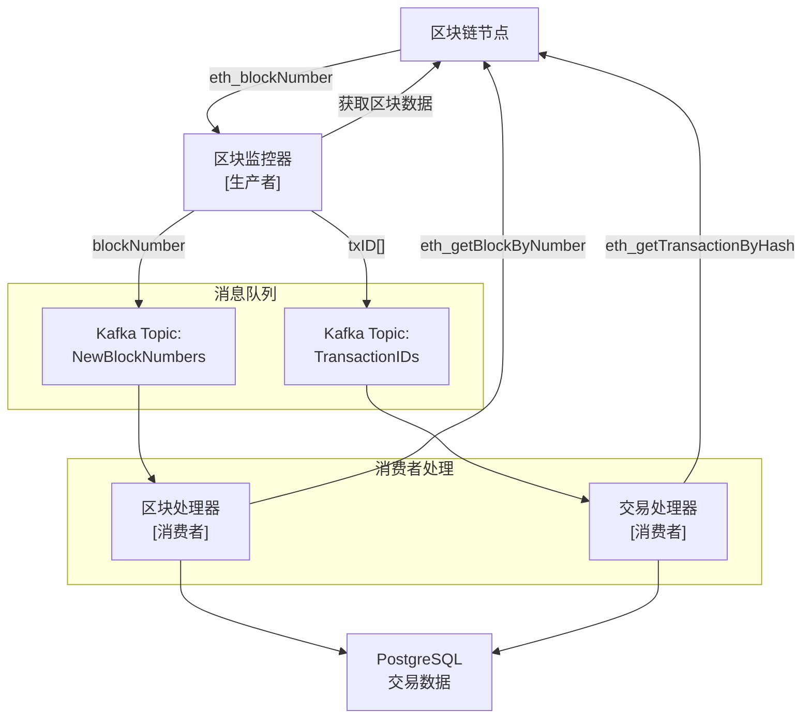

# EVM 区块索引器 (EVM Block Indexer)

## 项目简介

这是一个用 Go 语言开发的以太坊虚拟机(EVM)区块链索引器，用于高效地索引和查询区块链数据。该项目可以帮助开发者和研究人员更便捷地访问和分析区块链上的数据。

## 系统架构



### 架构说明

1. **生产者（区块监控器）**

    - 核心职责：
        - 监控最新区块号（eth_blockNumber）
        - 获取区块数据（eth_getBlockByNumber）
        - 提取区块中的所有交易 ID
        - 确保区块号连续性
        - 处理链重组情况
    - 数据分发：
        - 将区块号推送到 NewBlockNumbers 队列
        - 将交易 ID 列表推送到 TransactionIDs 队列
    - 保证数据完整性：
        - 确保每个区块的所有交易 ID 都被提取
        - 确保区块号的连续性
        - 发生重组时重新处理受影响区块

2. **消息队列**

    - NewBlockNumbers Topic：
        - 消息格式：区块号（整数）
        - 用途：保证区块处理顺序
    - TransactionIDs Topic：
        - 消息格式：{blockNumber, txID, index}
        - 用途：交易处理队列
        - 保证交易处理顺序

3. **消费者**
    - 区块处理器：
        - 消费区块号
        - 处理区块基本信息
        - 更新区块状态
    - 交易处理器：
        - 消费交易 ID
        - 获取详细交易数据
        - 处理交易信息

### 关键流程

1. **生产者处理流程**

```go
type BlockProducer struct {
    lastProcessedBlock uint64
    eth               *ethclient.Client
    kafka             *kafka.Producer
}

func (p *BlockProducer) Start() {
    for {
        // 获取最新区块号
        latestBlock, err := p.eth.BlockNumber(context.Background())
        if err != nil {
            time.Sleep(retryInterval)
            continue
        }

        // 处理从上次处理的区块到最新区块
        for blockNum := p.lastProcessedBlock + 1; blockNum <= latestBlock; blockNum++ {
            // 获取区块数据
            block, err := p.eth.BlockByNumber(context.Background(), big.NewInt(int64(blockNum)))
            if err != nil {
                continue
            }

            // 检查区块连续性
            if block.ParentHash() != p.lastBlockHash {
                // 处理链重组
                p.handleReorg(blockNum)
                continue
            }

            // 发送区块号到队列
            p.kafka.Produce("NewBlockNumbers", blockNum)

            // 提取并发送所有交易ID
            for txIndex, tx := range block.Transactions() {
                txInfo := TxInfo{
                    BlockNumber: blockNum,
                    TxID:       tx.Hash().Hex(),
                    Index:      uint64(txIndex),
                }
                p.kafka.Produce("TransactionIDs", txInfo)
            }

            p.lastProcessedBlock = blockNum
            p.lastBlockHash = block.Hash()
        }

        time.Sleep(pollingInterval)
    }
}
```

2. **消费者处理流程**

```go
// 交易处理器
type TxProcessor struct {
    eth    *ethclient.Client
    db     *sql.DB
}

func (p *TxProcessor) ProcessTransactions() {
    for txInfo := range kafka.Consume("TransactionIDs") {
        // 获取交易详情
        tx, _, err := p.eth.TransactionByHash(context.Background(), common.HexToHash(txInfo.TxID))
        if err != nil {
            continue
        }

        // 处理交易数据
        receipt, err := p.eth.TransactionReceipt(context.Background(), tx.Hash())
        if err != nil {
            continue
        }

        // 存储交易数据
        p.saveTransaction(tx, receipt, txInfo.BlockNumber, txInfo.Index)
    }
}
```

### 配置项

```yaml
producer:
    polling_interval: 1s # 区块监控间隔
    retry_interval: 5s # 错误重试间隔
    max_retries: 3 # 最大重试次数
    reorg_threshold: 100 # 链重组检测阈值

kafka:
    topics:
        block_numbers:
            name: NewBlockNumbers
            partitions: 1 # 保证区块号顺序
            retention: 24h # 消息保留时间
        transaction_ids:
            name: TransactionIDs
            partitions: 3 # 交易可并行处理
            retention: 24h # 消息保留时间

consumer:
    block_processor:
        batch_size: 100 # 批量处理大小
        concurrent: 1 # 保证顺序处理
    tx_processor:
        batch_size: 500 # 交易批量处理大小
        concurrent: 3 # 交易并行处理数
```

## 主要功能

-   实时区块数据同步
-   交易数据索引
-   智能合约事件监听
-   高性能数据查询接口
-   可配置的数据过滤器
-   支持多链索引

## 技术栈

-   语言：Go
-   数据库：PostgreSQL
-   区块链交互：Web3
-   API：RESTful / GraphQL

## 系统要求

-   Go 1.20 或更高版本
-   PostgreSQL 14.0 或更高版本
-   以太坊节点访问（可以是本地节点或远程节点）

## 安装说明

1. 克隆仓库

```bash
git clone https://github.com/yourusername/evm_block_indexer_go.git
cd evm_block_indexer_go
```

2. 安装依赖

```bash
go mod download
```

3. 配置环境变量

```bash
cp .env.example .env
# 编辑 .env 文件，填入必要的配置信息
```

4. 运行数据库迁移

```bash
make migrate
```

5. 启动服务

```bash
make run
```

## 配置说明

主要配置项包括：

-   `DB_CONNECTION`: 数据库连接字符串
-   `ETHEREUM_RPC`: 以太坊节点 RPC 地址
-   `START_BLOCK`: 开始同步的区块高度
-   `BATCH_SIZE`: 批量处理的区块数量

## 使用方法

1. 启动索引服务：

```bash
./evm_block_indexer start
```

2. 查询特定区块数据：

```bash
curl http://localhost:8080/api/v1/blocks/{block_number}
```

3. 查询特定交易：

```bash
curl http://localhost:8080/api/v1/transactions/{tx_hash}
```

## API 文档

详细的 API 文档请访问：`http://localhost:8080/swagger/index.html`

## 开发指南

1. 代码规范

-   遵循 Go 标准代码规范
-   使用 `gofmt` 格式化代码
-   提交前运行测试套件

2. 测试

```bash
make test
```

3. 构建

```bash
make build
```

## 贡献指南

欢迎提交 Pull Request 来改进项目。在提交 PR 之前，请确保：

1. 代码已经经过测试
2. 所有测试用例都通过
3. 代码符合项目规范
4. 更新了相关文档

## 许可证

MIT License
